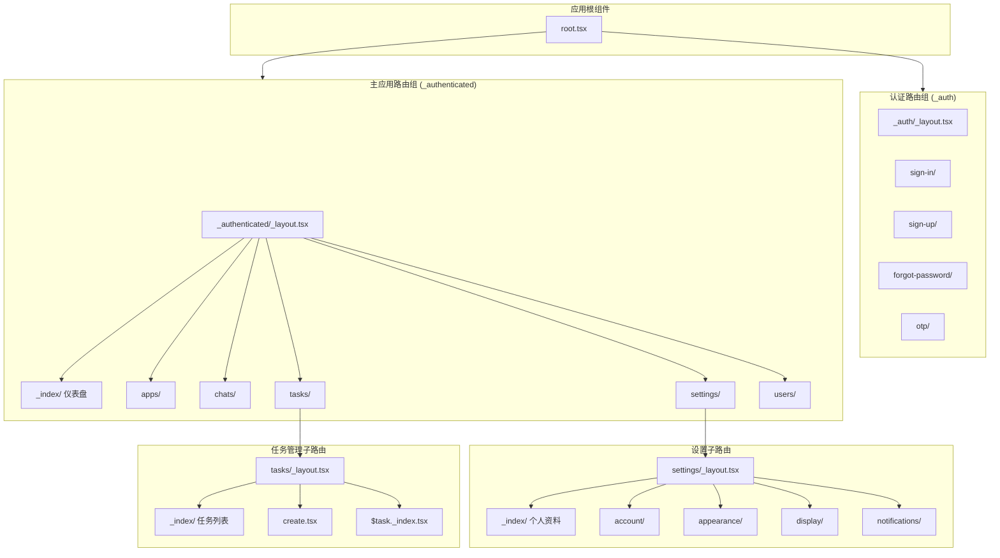
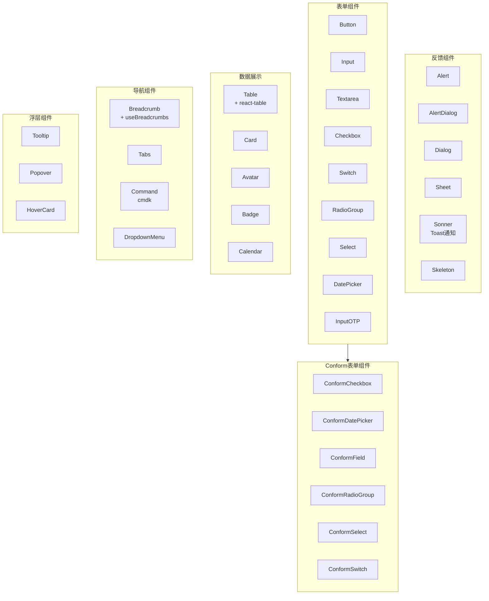
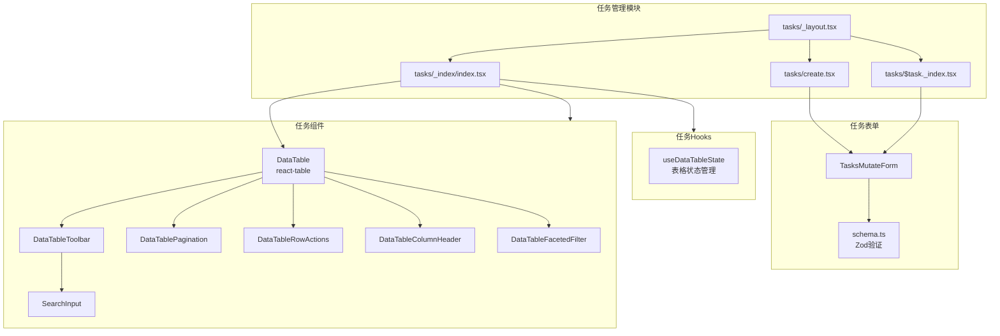
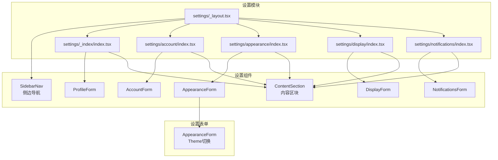
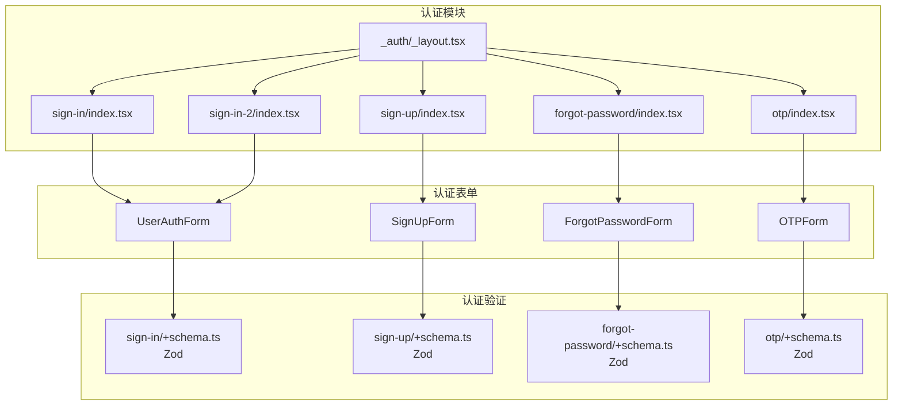
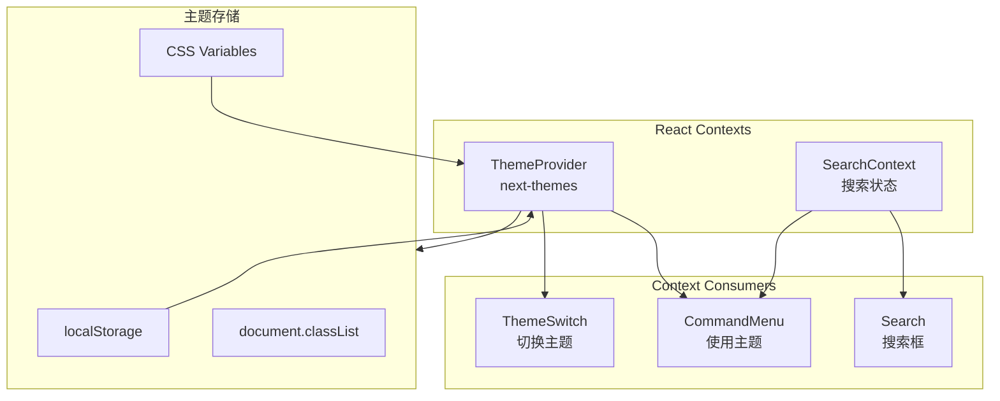
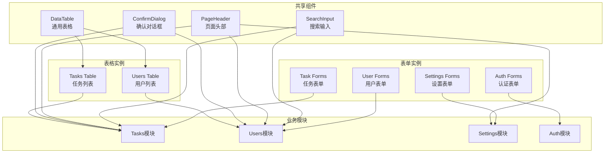

# 组件关系图

## 1. 整体架构图



## 2. 布局组件层级图

```mermaid
graph TB
    subgraph AppLayout["App Layout Structure"]
        AppSidebar["AppSidebar"]
        Header["Header"]
        Main["Main"]
    end

    subgraph SidebarContent["Sidebar Components"]
        SidebarHeader["SidebarHeader"]
        SidebarContent["SidebarContent"]
        SidebarFooter["SidebarFooter"]
    end

    subgraph NavComponents["Navigation Components"]
        NavGroup["NavGroup"]
        NavUser["NavUser"]
        TeamSwitcher["TeamSwitcher"]
        NavItems["Nav Items"]
    end

    subgraph HeaderComponents["Header Components"]
        Breadcrumbs["Breadcrumbs<br/>useBreadcrumbs hook"]
        Search["Search"]
        CommandMenu["CommandMenu"]
        ProfileDropdown["ProfileDropdown"]
        ThemeSwitch["ThemeSwitch"]
    end

    AppLayout --> AppSidebar
    AppLayout --> Header
    AppLayout --> Main
    
    AppSidebar --> SidebarHeader
    AppSidebar --> SidebarContent
    AppSidebar --> SidebarFooter
    
    SidebarHeader --> TeamSwitcher
    SidebarContent --> NavGroup
    SidebarFooter --> NavUser
    NavGroup --> NavItems
    
    Header --> Breadcrumbs
    Header --> Search
    Header --> CommandMenu
    Header --> ProfileDropdown
    ProfileDropdown --> ThemeSwitch
```

## 3. UI组件体系图



## 4. 任务管理模块组件图



## 5. 用户管理模块组件图

```mermaid
graph TB
    subgraph UsersModule["用户管理模块"]
        UsersIndex["users/_index/index.tsx"]
        UserCreate["users/create.tsx"]
        UserDetail["users/$user._index.tsx"]
        UserInvite["users/invite.tsx"]
    end

    subgraph UsersComponents["用户组件"]
        UsersTable["UsersTable<br/>DataTable"]
        UsersColumns["UsersColumns"]
        UsersMutateForm["UsersMutateForm"]
        UserDeleteDialog["UserDeleteConfirmDialog"]
    end

    subgraph UsersData["用户数据"]
        UsersData["users.ts<br/>模拟数据"]
        UserSchema["schema.ts<br/>Zod验证"]
    end

    UsersIndex --> UsersTable
    UsersTable --> UsersColumns
    UsersTable --> UserDeleteDialog
    UserCreate --> UsersMutateForm
    UserDetail --> UsersMutateForm
    UsersMutateForm --> UserSchema
    UsersComponents --> UsersData
```

## 6. 设置模块组件图



## 7. 自定义Hooks依赖图

```mermaid
graph LR
    subgraph Hooks["自定义 Hooks"]
        useBreadcrumbs["useBreadcrumbs"]
        useDebounce["useDebounce"]
        useDialogState["useDialogState"]
        useMobile["useMobile"]
        useSmartNavigation["useSmartNavigation"]
        useDataTableState["useDataTableState<br/>表格状态"]
    end

    subgraph ReactRouter["React Router"]
        useMatches["useMatches"]
        useMatches2["useMatches"]
        href["href"]
        Link["Link"]
    end

    subgraph React["React"]
        useState["useState"]
        useEffect["useEffect"]
        useCallback["useCallback"]
        useMemo["useMemo"]
    end

    subgraph External["外部库"]
        setTimeout["setTimeout"]
        localStorage["localStorage"]
    end

    useBreadcrumbs --> useMatches
    useBreadcrumbs --> Link
    useBreadcrumbs --> href
    
    useDebounce --> useState
    useDebounce --> useEffect
    useDebounce --> setTimeout
    
    useDialogState --> useState
    useDialogState --> useCallback
    
    useMobile --> useEffect
    useMobile --> useState
    useMobile --> localStorage
    
    useSmartNavigation --> useMatches2
    useSmartNavigation --> useCallback
    
    useDataTableState --> useState
    useDataTableState --> useCallback
    useDataTableState --> useMemo
```

## 8. 认证路由组件图



## 9. Context 数据流图



## 10. 组件复用关系图


